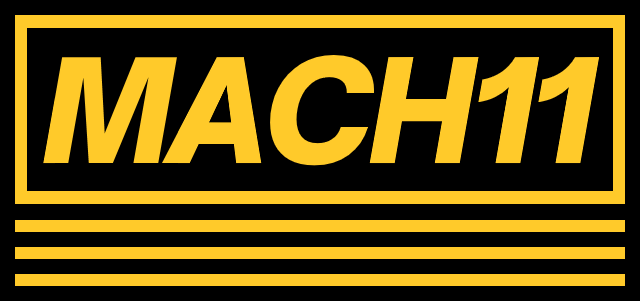
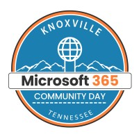

<a name="readme-top" id="readme-top"></a>

<!-- PROJECT LOGO -->
<br />
<div align="center">
  <a href="https://github.com/mach11co/M365CD022825">
    
  </a>
<br />
  <a href="https://www.communitydays.org/event/2025-02-27/knoxville-microsoft-365-community-day">
    
  </a>

<h3 align="center">Session resources for M365 Community Days Talk</h3>

  <p align="center">
    Power Up Your Personal and Professional Productivity with Agile Principles
    <br />
    <a href="https://github.com/mach11co/M365CD022825/issues">Report Bug</a>
    ·
    <a href="https://github.com/mach11co/M365CD022825/issues">Request Feature</a>
  </p>
</div>

<!-- TABLE OF CONTENTS -->
<details>
  <summary>Table of Contents</summary>
  <ol>
    <li>
      <a href="#about-the-project">About The Project</a>
      <ul>
        <li><a href="#built-with">Built With</a></li>
      </ul>
    </li>
    <li><a href="#directories">Directories</a></li>
    <li><a href="#contact">Contact</a></li>
  </ol>
</details>

## About The Project

These are the resources for the [Knoxville M365 Community Day](https://www.communitydays.org/event/2025-02-27/knoxville-microsoft-365-community-day) Session on Power Up Your Personal and Professional Productivity with Agile Principles

[![Presentation Screen Shot][presentation-screenshot]](https://github.com/mach11co/M365CD022825/tree/main/presentation/)

<p align="right">(<a href="#readme-top">back to top</a>)</p>

### Built With

- [![OneNote][onenote.com]][OneNote-url]

<p align="right">(<a href="#readme-top">back to top</a>)</p>

## Directories

```
│
├───notebook
│       M365 Community Day 2025.onepkg
├───presentation
│       Power Up Your Personal and Professional Productivity with Agile Principles.pptx


```

- `README.md` resources

<p align="right">(<a href="#readme-top">back to top</a>)</p>

## Contact

MACH11, LLC - info@mach11.co

Project Link: [https://github.com/mach11co/M365CD022825](https://github.com/mach11co/M365CD022825)

<p align="right">(<a href="#readme-top">back to top</a>)</p>

<!-- MARKDOWN LINKS & IMAGES -->
<!-- https://www.markdownguide.org/basic-syntax/#reference-style-links -->

[presentation-screenshot]: /src/assets/img/presentation-screenshot.png
[OneNote.com]: https://img.shields.io/badge/Microsoft-OneNote-591e90?logo=Microsoft
[OneNote-url]: https://www.onenote.com/
